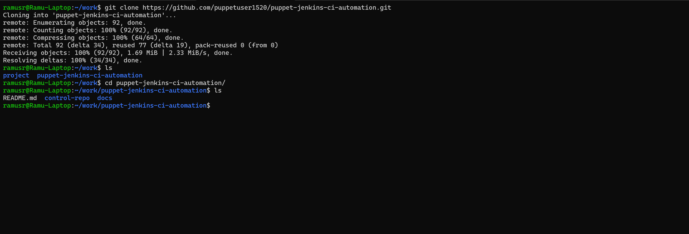
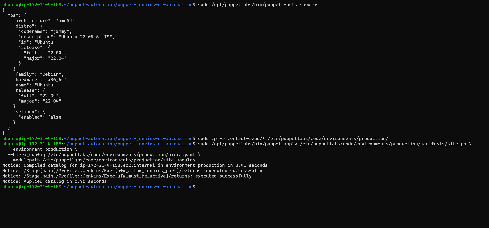
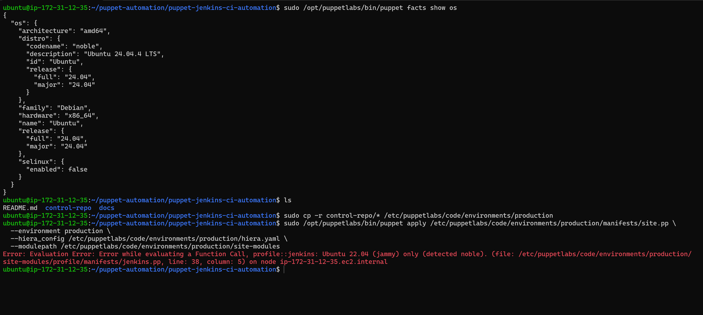
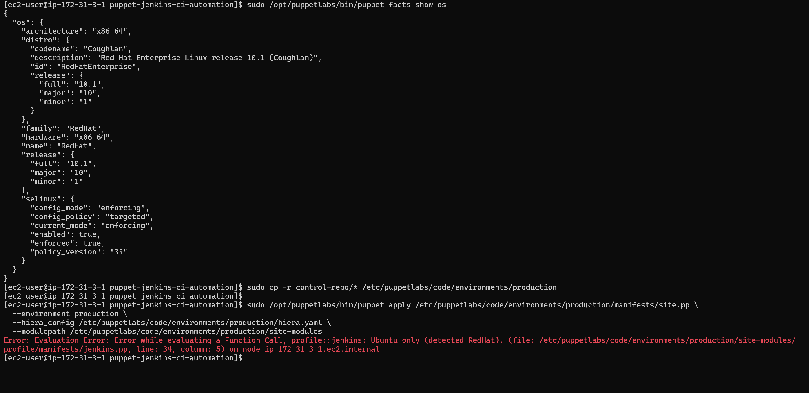
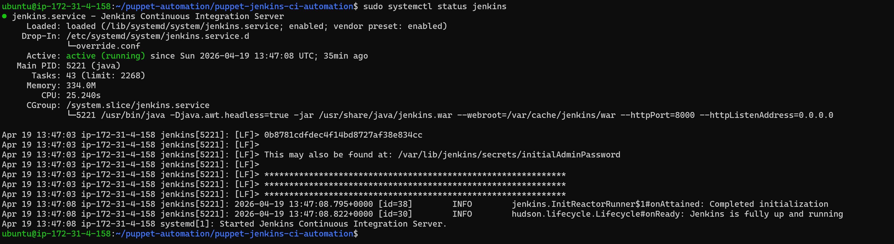
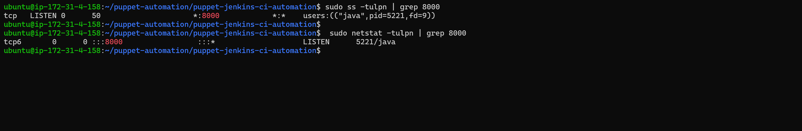
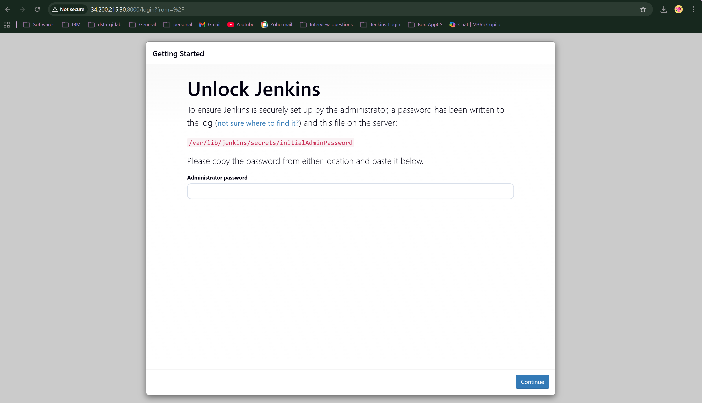
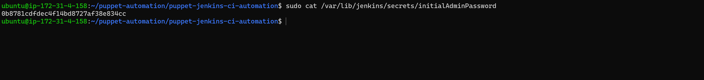
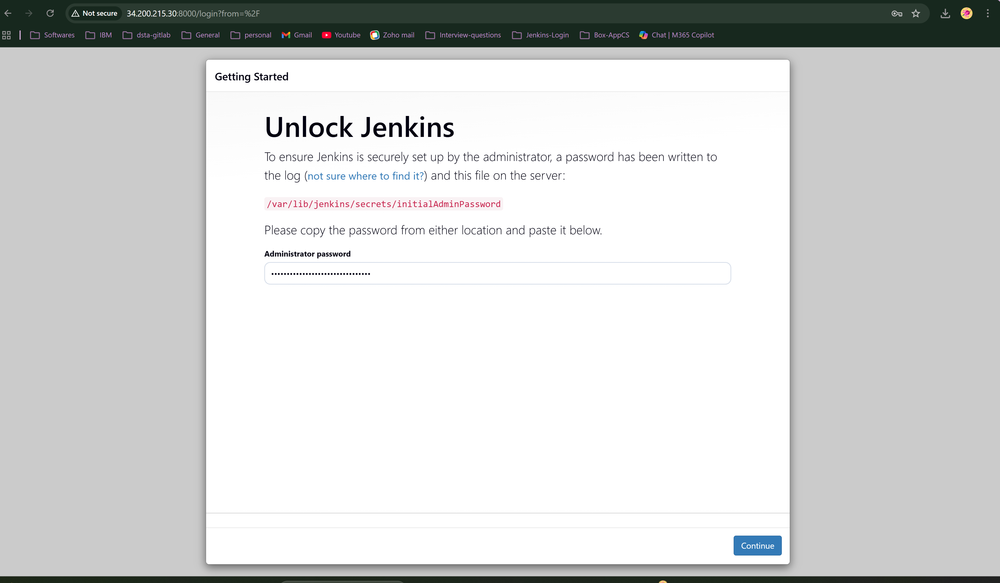
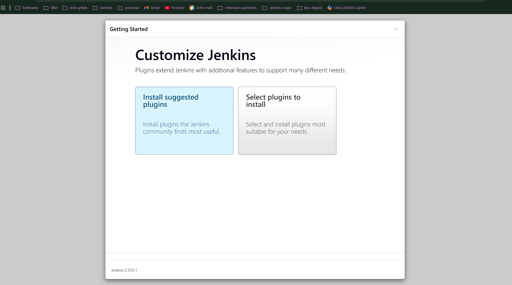

***

# Jenkins CI Automation with Puppet (Ubuntu 22.04)

## 1. Introduction

This project provides a **fully automated, idempotent Puppet solution** to install and configure the **Jenkins Continuous Integration server** on **Ubuntu 22.04 (Jammy Jellyfish)**.

The automation follows **Puppet best practices**:

*   **Roles & Profiles** pattern for separation of concerns
*   **Data‑driven configuration** using Hiera
*   **No external Puppet Forge modules** (only core Puppet resources)
*   **Idempotent execution** so repeated runs are safe
*   **Upgrade‑safe Jenkins configuration** using systemd drop‑in overrides

Jenkins is explicitly configured to **listen on port 8000**, satisfying the requirement that Jenkins itself—not port forwarding—serves traffic on that port.

***

## 2. Prerequisites (Environment)

### Supported Operating System

*   **Ubuntu 22.04 LTS (Jammy Jellyfish)**
    *   This solution intentionally fails fast on unsupported operating systems.

### Required Software

*   **Puppet Agent** (Open Source)
*   **systemd** (default init system on Ubuntu 22.04)
*   **Internet access** to download Jenkins packages and dependencies

### Assumptions

*   The system starts as a **clean OS installation**
*   The user has **root or sudo privileges**
*   No Jenkins installation exists prior to applying this solution

***

## 3. Puppet Installation Steps (Ubuntu 22.04)

```bash
Puppet Installation Steps (Ubuntu 22.04 – Jammy)

1. Update the system package index:
   sudo apt-get update

2. Install required dependencies:
   sudo apt-get install -y wget ca-certificates gnupg lsb-release

3. Download and install the official Puppet 7 repository package:
   wget https://apt.puppet.com/puppet7-release-jammy.deb
   sudo dpkg -i puppet7-release-jammy.deb

4. Refresh the package index after adding the Puppet repository:
   sudo apt-get update

5. Install the Puppet Agent:
   sudo apt-get install -y puppet-agent

6. Add Puppet binaries to the system PATH:
   export PATH=$PATH:/opt/puppetlabs/bin

7. Verify the installation:
   puppet --version

8. (Optional) Start and enable the Puppet service:
   sudo systemctl start puppet
   sudo systemctl enable puppet
```

Once Puppet is installed, no additional Ruby libraries, Forge modules, or plugins are required.

***

## 4. Project Structure

```text
control-repo/
├── environment.conf
├── hiera.yaml
├── manifests/
│   └── site.pp
├── data/
│   ├── common.yaml
│   └── env/
│       └── production.yaml
└── site-modules/
    ├── role/
    │   └── manifests/
    │       └── jenkins_controller.pp
    └── profile/
        ├── manifests/
        │   └── jenkins.pp
        └── templates/
            └── jenkins_override.conf.erb
```

### Structure rationale

*   **Role** describes *what* the node is: `jenkins_controller`
*   **Profile** describes *how* Jenkins is installed/configured
*   **Hiera data** controls all environment‑specific values (port, packages, paths)

***

## 5. Project Automation Flow (Conceptual Diagram)

```text
+--------------------------------------------------+
           |     Puppet Apply        |
           +-------------------------+
                       |
                       v
           +-------------------------+
           | role::jenkins_controller|
           +-------------------------+
                       |
                       v
           +-------------------------+
           |     profile::jenkins    |
           +-------------------------+
                       |
   +-----------+-----------+-----------+------------+
   |           |           |           |            |
   v           v           v           v            v
 OS Checks   Packages    Jenkins Repo  systemd     Firewall
                                         Override   (Optional)
                                                     |
                                                     v
                                           Port 8000 Open
                                                     |
                                                     v
                                            Jenkins on Port 8000
```

***

## 6. Project Execution Explanation

1.  **Classification**
    *   The node is assigned `role::jenkins_controller` from `site.pp`.

2.  **Profile execution**
    *   `profile::jenkins` installs prerequisites and Java.
    *   Jenkins APT repository and signing key are configured.
    *   Jenkins package is installed.
    *   A **systemd drop‑in override** file is created to set `JENKINS_PORT=8000`.

3.  **Idempotency**
    *   `exec` resources are guarded with `creates`, `unless`, or `refreshonly`.
    *   `systemctl daemon-reload` and Jenkins restarts occur **only when configs change**.
    *   Re‑running Puppet produces **no redundant actions**.


***

## 7. Project Execution Step

Apply Puppet Configuration (Execution Step)

After installing Puppet and ensuring all manifests, modules, and Hiera data are in place, apply the Puppet configuration using the following command:

### a) Cloning the project repository into the local system

```bash
git clone https://github.com/puppetuser1520/puppet-jenkins-ci-automation.git
```


### b) Copy the Cloned Project into puppet standard code path

```bash
sudo cp -r $HOME/puppet-jenkins-ci-automation/control-repo /etc/puppetlabs/code/environments/production/
```
### c) Execute the puppet apply command 

```bash
sudo /opt/puppetlabs/bin/puppet apply /etc/puppetlabs/code/environments/production/manifests/site.pp \
  --environment production \
  --hiera_config /etc/puppetlabs/code/environments/production/hiera.yaml \
  --modulepath /etc/puppetlabs/code/environments/production/site-modules
```
This command applies the production environment configuration by:
- Executing the main site manifest (site.pp)
- Using the production environment
- Loading Hiera data from hiera.yaml
- Resolving custom modules from the site-modules directory

## a) Project execution result on Ubuntu-22.04 (jammy)


## a) Project execution result on Ubuntu-24.04 (noble)


## a) Project execution result on RedHat-10.1 (Coughlan)


## 8. VERIFICATION STEPS


1. Verify Jenkins service status:

```bash
   sudo systemctl status jenkins
```
   (Service should be shown as "active (running)")

  

2. Confirm Jenkins is listening on port 8000:

```bash
   sudo ss -tulpn | grep 8000
   or
   sudo netstat -tulpn | grep 8000
```



3. Access Jenkins via web browser:
   http://<server-ip>:8000



4. Retrieve the initial Jenkins admin password:

```bash
   sudo cat /var/lib/jenkins/secrets/initialAdminPassword
```


5. Log in to the Jenkins UI using the initial admin password to complete setup.
   




RESULT

Jenkins is successfully installed, running, and accessible via the web interface.

***

## 9. Required Question Answers

### a) Most difficult hurdle

### 1) **Jenkins Java Version Compatibility Changed**

**What happened**

*   Jenkins started successfully installing, but failed during service startup.
*   Systemd logs showed:
        Java 17 ... is older than the minimum required version (Java 21)

**Why this is a hurdle**

*   Jenkins LTS **recently raised the minimum Java requirement**.
*   The Puppet code was technically correct, but relied on an **outdated assumption** about Jenkins Java support.

**Learning**

*   Infrastructure automation must track **application lifecycle changes**, not just OS compatibility.
*   Puppet did its job; the failure was **application‑level**, not configuration‑level.

***

### 2) **`puppet apply` Does Not Auto‑Determine Node Identity**

**What happened**

*   Hiera node‑specific data didn’t resolve until `--node_name_value` was explicitly provided.

**Why this is a hurdle**

*   When running `puppet apply`, there is:
    *   no certificate
    *   no real `certname`
*   `%{trusted.certname}` is undefined unless manually set.

**Learning**

*   Node identity must be **explicitly simulated** when using `puppet apply`.
*   This differs from Puppet Server behavior and can confuse first‑time users.

***

### 3) **Systemd Back‑off Masked Subsequent Fixes**

**What happened**

*   Multiple failed Jenkins starts caused systemd to stop retrying.
*   Even after correcting configuration, Jenkins would not restart.

**Why this is a hurdle**

*   Systemd’s restart back‑off is **stateful**.
*   Puppet cannot automatically reset failed services.

**Mitigation Required**

```bash
sudo systemctl reset-failed jenkins
```

**Learning**

*   Application service managers can introduce **hidden operational states** that configuration tools don’t reset automatically.

***

### 4) **Modern APT Key Handling Is More Complex**

**What happened**

*   Jenkins repository now requires:
    *   dedicated keyring directory
    *   `signed-by=` configuration
*   Traditional `apt-key` approach is deprecated.

**Why this is a hurdle**

*   Older tutorials and automation examples **no longer work**.
*   Requires additional Puppet resources and ordering.

**Learning**

*   OS‑level security hardening directly increases IaC complexity.
*   Automation must evolve with platform security standards.

***

### 5) **Order and Notification Chains Are Critical**

**What happened**

*   Jenkins startup depends on this precise sequence:
    1.  Java installed
    2.  Jenkins repo added
    3.  Apt update triggered
    4.  Jenkins installed
    5.  systemd override written
    6.  daemon reload
    7.  service restart

**Why this is a hurdle**

*   Any missing `require` / `notify` link:
    *   breaks idempotence
    *   causes race conditions

**Learning**

*   Declarative tools still require **careful dependency modeling**.
*   Puppet gives control—but only if dependency chains are explicitly defined.

***

### 6) **Port Configuration Requires systemd Overrides**

**What happened**

*   `/etc/default/jenkins` was ignored by the package.
*   Jenkins picked up port changes only via systemd drop‑in.

**Why this is a hurdle**

*   Package behavior changed silently.
*   Configuration files once considered canonical are no longer respected.

**Learning**

*   OS and vendor packaging decisions can invalidate legacy configuration patterns.
*   Using systemd drop‑ins is now the **correct, future‑proof approach**.

***

### 7) **Separation of Roles & Profiles Requires Discipline**

**What happened**

*   It’s tempting to place resources directly inside roles or site.pp.

**Why this is a hurdle**

*   Violates Puppet best practices.
*   Leads to unscalable, tightly coupled code.

**Learning**

*   Roles/profiles adds **initial structure overhead**, but pays off in clarity and scalability.
*   Correct separation makes troubleshooting significantly easier.

***

### b) Why requirement (f) is important

Requirement (f) enforces **idempotency**, which is fundamental to configuration management.  
Without idempotency:

*   Automation becomes unsafe
*   Re-runs may cause repeated restarts or failures
*   Configuration drift increases

Puppet’s ability to apply the same manifests repeatedly while maintaining the desired state—without unnecessary changes—is what makes it suitable for long‑lived infrastructure.

Official Puppet documentation on idempotency:  
<https://help.puppet.com/pe/current/topics/understanding_idempotency.html> [\[help.puppet.com\]](https://help.puppet.com/pe/current/topics/understanding_idempotency.htm)

***

### c) Sources of information

Primary sources used:

*   **Jenkins official documentation**

    *   Jenkins Java Version Compatibility Changed
        <https://www.jenkins.io/doc/book/platform-information/support-policy-java/> [\[jenkins.io\]](https://www.jenkins.io/doc/book/platform-information/support-policy-java)
    *   systemd service overrides  
        <https://www.jenkins.io/doc/book/system-administration/systemd-services/> [\[jenkins.io\]](https://www.jenkins.io/doc/book/system-administration/systemd-services/)
    *   repository key rotation blog  
        <https://www.jenkins.io/blog/2025/12/23/repository-signing-keys-changing/> [\[jenkins.io\]](https://www.jenkins.io/blog/2025/12/23/repository-signing-keys-changing/)

*   **Puppet official documentation**
    *   Idempotency concepts  
        <https://help.puppet.com/pe/current/topics/understanding_idempotency.htm> [\[help.puppet.com\]]( https://help.puppet.com/pe/current/topics/understanding_idempotency.htm)

No third‑party Puppet modules or copied community code were used.

***

### d) What automation means and why it matters

Automation means defining infrastructure and system configuration as **code that expresses intent**, not imperative steps.  
It enables:

*   Consistency across environments
*   Reduced human error
*   Safe reconfiguration at scale
*   Faster recovery from failure

In an organization’s infrastructure strategy, automation allows systems to be **reliably rebuilt, updated, and audited**, forming the foundation of scalable, secure CI/CD and cloud‑native operations.

***
